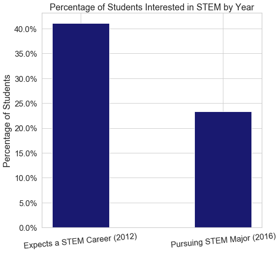
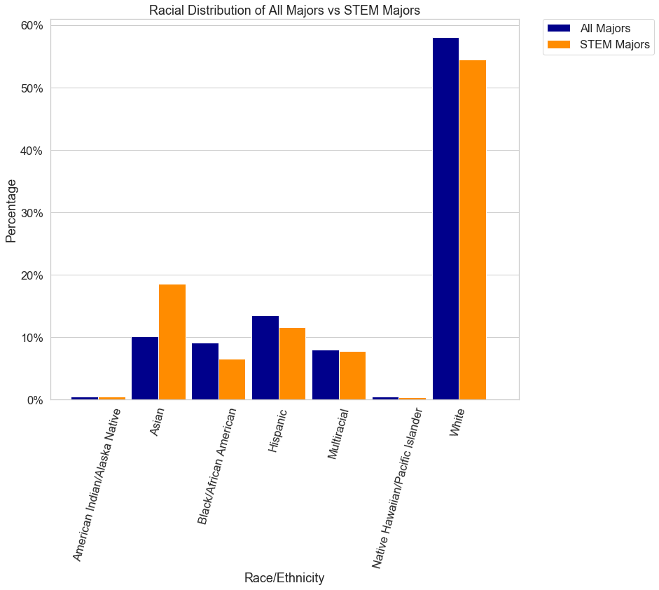
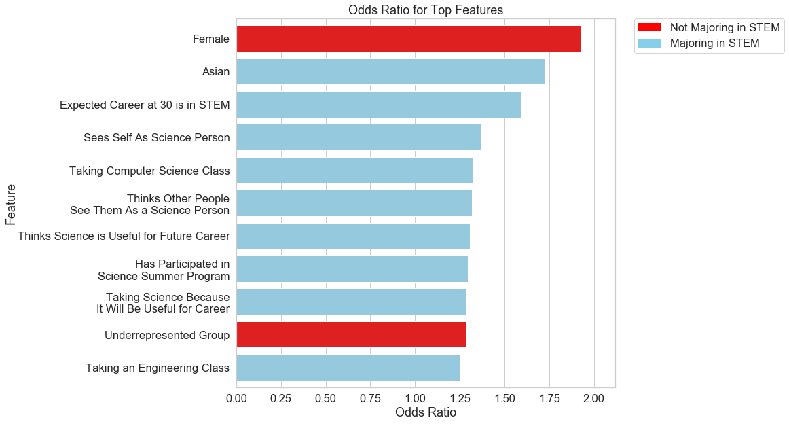

# Increasing STEM Enrollment
#### *Lauren Phipps*

<span>Photo by <a href="https://unsplash.com/@cheaousa?utm_source=unsplash&amp;utm_medium=referral&amp;utm_content=creditCopyText">Ousa Chea</a> on <a href="https://unsplash.com/s/photos/science-education?utm_source=unsplash&amp;utm_medium=referral&amp;utm_content=creditCopyText">Unsplash</a></span>

## Overview

STEM jobs are growing at rate double that of non-STEM jobs. With a majority of these jobs requiring a college degree, we need to ensure we have enough students pursuing STEM majors to be able to fill these roles. There are many factors that a student considers when deciding on a college major - what they are good at, what they are passionate about, what will lead to the best job, what their parents or mentors expect from them, and so on. With the United States Department of Education investing significant money into STEM education to meet the growing needs of a qualified workforce, it is important to isolate the factors of a student's high school experience that impact their decision to pursue a STEM major in college. This project aimed to create a model that will determine these factors. Using a tuned logisitic regression model (F1 score of 0.52), I found that the most influential factors were: a student's gender (with male students being twice as likely to go into STEM), if a student is Asian, if a student expects to have a STEM career at 30, if a student sees themselves as a science person, and if they are taking a computer science class. Using this analysis, I recommend that the best way to invest is in science class elective programs, career focused programs, and in diversifying representation in STEM through career talks and mentorship programs. 

## Business Problem
In 2020 alone, the Department of Education invested $578 million to support STEM (science, technology, engineering, and math) education programs. As the number of STEM jobs is growing at a rate that far exceeds non-STEM jobs (10.2% vs. 5.2%, respectively, from 2009-2015), it is becoming increasingly pressing and important to have a substantial number of qualified candidates for these jobs. Over 90% of jobs in STEM require a college degree (Associate's degree or higher), so filling these roles means preparing students to pursue a STEM major in college. It is important to understand what factors and high school science experiences influence a student's decision to major in STEM, in order to know how to best invest this money. This project aims to determine these factors.

## Data Understanding
The data in this project comes from the [2009 High School Longitudinal Study](https://nces.ed.gov/surveys/hsls09/index.asp) from the National Center for Education Statistics within the United States Department of Education. The study surveyed over 23,000 students during the fall of their 9th grade year (baseline), two years later in the spring of their 11th grade year (2012), their 12th grade year (2013), and again three years after their expected high school graduation year (in 2016). The students in this study come from 944 different schools, both public and private, from all states across the United States. Each row in the dataset is a student and each feature is a question on the survey.

This project focused on the survey responses from the 2012 survey in order to get a more complete representation of the student's high school experience, with regards to impressions of science and participation in science activities. The target for the project comes from the 2016 survey, where students indicate whether or not they are enrolled in a STEM major. Only students who responded to the 2016 survey question were included in the modeling data set.  While there are many features included in the dataset, this project focused on the student's attitude towards science, specific experiences related to science (class enrollment, participation in clubs), impression of their science teacher, and their reasoning for taking science classes, along with their gender and race/ethnicity. 

A full feature list can be found [here](https://docs.google.com/spreadsheets/d/1cX3M1SLAUiPXo45eHvJOamPJ8VM-0WFzSrHBt4C-z0U/edit?usp=sharinghttps://docs.google.com/spreadsheets/d/1cX3M1SLAUiPXo45eHvJOamPJ8VM-0WFzSrHBt4C-z0U/edit?usp=sharing). The dataset and the corresponding codebook can be downloaded [here](https://nces.ed.gov/OnlineCodebook/Session/Codebook/2763d538-4998-41a8-81bc-bd2b3d972065). 

## Data Preparation
Because the dataset is a follow up to a baseline survey, some of the initial respondents did not participate in this follow up survey. This was seen as a `'-8': Unit Non-Response` and these 2,909 rows were dropped since all answers were blank. As it is a survey, the majority of the data cleaning involved handling null values, which were coded as negative values depending on if they were declared N/A and skipped legitimately or left blank. As the features were turned into binary, dummy variables with a positive being `'1'` and all other values being `'0'`, the null values were coded to `'0'`. 

To consolidate the list of science class options, I created new features that grouped them into: `bio`, `chem`, `physics`, `engineering`, `environmental science`, `computer science`, and `miscellaneous` (for classes such as "general science"). Additionally, the features that were presented as a likert scale were converted to a simple agree/disagree to better align with the other binary variables. 

Lastly, in order to map to the target variable, the student must have responded to the 2016 survey question that asks if they are pursuing a STEM major. Students who did not respond with a yes or no were dropped from the dataframe used in modeling. They were included in any exploratory analysis done within the 2012 survey; however, any analysis done with ties to the target variable does not include those students. The modeling dataframe contained 10,974 rows (students).

The complete data cleaning process can be found [here](http://localhost:8890/lab/tree/custom_functions.py). 

## Results

Based on my own experience in STEM, both as a student and a teacher, I began by doing an exploratory analysis on how student's expectations may change over time, on a student's perception of themselves as a science person differs by race and gender, and the demographic breakdown of STEM majors vs all majors.  



This shows that many more students expect to have a STEM career at 30 than end up pursuing a STEM major four years later, at 41% and 23%, respectively. There are many factors that can cause a student to change their career aspirations over time. While some of this is inenvitable, it would be worth further analyzing when these changes occur and the motivating factor for it. Additionally, it further stresses the importance of engaging more students before college, as there will be students who change from STEM to non-STEM during college.  


This chart shows the percentage of each gender and race that see themselves as a science person. Overall, a higher percentage of male students saw themselves as science people than female students (with Native Hawaiian/Pacific Islander female students as the exception). Black/African American female students and Hispanic female students had the lowest percentage who saw themselves as science people at 43% and 44%, respectively. Asian male students, Multiracial male students, and White male students had the highest percentages at 65%, 61%, and 61%, respectively.


This chart shows that females are signficantly underrepresented as STEM majors. Female students made up 55% of the target dataset (all majors), but only 37% of STEM majors.



The above graph shows that Black/African American, Hispanic, and White students are all underrepresented within STEM, while Asian students make up a larger percentage of STEM majors than in the overall distribution. Knowing from the previous chart that females are also underrepresented, it would be worth further breaking this down by gender to see how much of the underrepresentation comes from the underrepresentation of women. Overall, though, Black/African students have the most significant underrepresentation within the STEM majors, with their representation being about 1/3 of what it is among all majors.

Moving towards modeling, this project is focused on creating a highly interpretable model to understand how each feature impacts whether or not a student selects a STEM major. Using F1 score as my main evaluation metric, the best model was the Logistic Regression with the hyperparamaters optimized using GridSearch. From this model, the coefficients lead to the following odds ratios.



The factor that had the largest impact on whether or not a student went into STEM is their gender. A female student is twice as likely to *not* pursue a STEM major as a male student. Additionally, an Asian student is 75% times more likely to go into STEM as a White student. This model shows that a student's self-concept in science, which is their own perception of if they are a science person and if others see them as a science person, are two of the top influences. 

As this data comes from an 11th grade student, a student's expected career weighs heavily, as well. High school students who expected to have a STEM career at 30 were more likely to be majoring in STEM. Similarly, students who were taking a science class because they knew it would be useful for a future career or thought science was useful for careers were 20% more likely to later enroll in a STEM major. Each of these show that many students have made decisions about their college interests and careers by the time they are in 11th grade. 

Lastly, students taking engineering and computer science classes in 11th grade were more likely enroll in a STEM major than other science classes, or not taking a science class. Engineering and computer science are not often included in graduation requirements, so it's possible that students who are taking these classes have already fulfilled the science requirements, thereby showing their interest in science. Students seeking out electives are going to be more interested in continuing their studies in the future. Another possibility is that those two science classes are closely tied to specific careers that are well known to be in high demand (and were at the time of this survey, as well). Students who take those classes may be taking those classes because they want to be engineers or computer scientists. 


## Evaluation

This project used F1 score as it's main evaluation metric because of the class imbalance and because neither false negatives nor false positives were more detrimental. The score was 0.52, which is better random guessing, but not a highly accurate model for prediction. 


The above confusion matrix further highlights that the model needs additional information about what factors impact a student becoming a STEM major, as it incorrectly assigned 495 students to be STEM majors that were not. As expected, more factors influence a student's decision to pursue a STEM major than are contained within this dataset.  

## Conclusions

This project aimed to determine the aspects of a student's high school experience that may be the most influential in their pursuit of a STEM degree in college. This project specifically focused on academic decisions and their attitudes towards science and science classes, along with their race and gender. The results from the final model were clear. Career aspiration, as well as self-concept in science and science identity, impact a student's decision to pursue a STEM major. Recommendations to address those are below:

- It is important to fund more elective science classes, such as engineering and computer science, to open up more of the STEM world to students and to, hopefully, give them a concrete understanding about what they can do with STEM as a career.

- Investing in career awareness and giving students a clear vision of what a STEM career looks like is important. Students who see this as a future career will be more likely to major in a STEM field and keep students engaged in STEM.

- Investment must be made in showing diverse representations of the STEM field. Women being underrepresented in STEM can have an impact on whether or not a female student sees herself as a science person or thinks that other people see her as a science person. The visuals we consume on a daily basis, whether in media, the news, or in school, can influence how we see ourselves in the world and this is a reminder of the importance of highlighting all genders and races/ethnicities in the STEM field. Investing in programs that bring in a diverse group of STEM professionals to talk with students could help students see themselves as science people more, as well as learn more about careers. Mentorship programs with STEM professionals for underrepresented groups could also be beneficial.

- Begin these programs as early as possible. Supporting high school students and keeping them engaged is very important. However, it is also important to improve students' self-concept in science and science identity from a young age. As evidence from this study, many students have a vision of what they expect from their future career by high school. It is harder to change the mind of a student who has spent 16 years thinking that they are not a science person than it is to encourage a student from the very beginning that they are. 


## Next Steps

A few next steps would be break the analysis into specific underrepresented groups, such as female students or Black or Hispanic students, to create more targeted recommendations. From this model, it is also clear that a lot more information goes into a student's decision to study STEM. Pulling in more demographic, family, and socioeconomic information could create a fuller picture of a student's decision. It would also be beneficial to continue this analysis with the baseline survey from their freshman year to understand how attitudes might be changing over the course of their high school career. From a broader standpoint, doing a longer-term longitudinal study would be incredibly useful to get a sense of when STEM interest is piqued and how it may wane over the years. 


## Repository Structure

```
├── img                          <- Images and charts used in this project
├── notebooks                    <- Scratch notebooks used
├── custom_functions.py          <- Py file of functions used in data cleaning and prep
├── Final-Notebook.ipynb         <- Final notebook of project
├── README.md                    <- The high-level overview of this project
└── Presentation.pdf             <- PDF version of project presentation
```